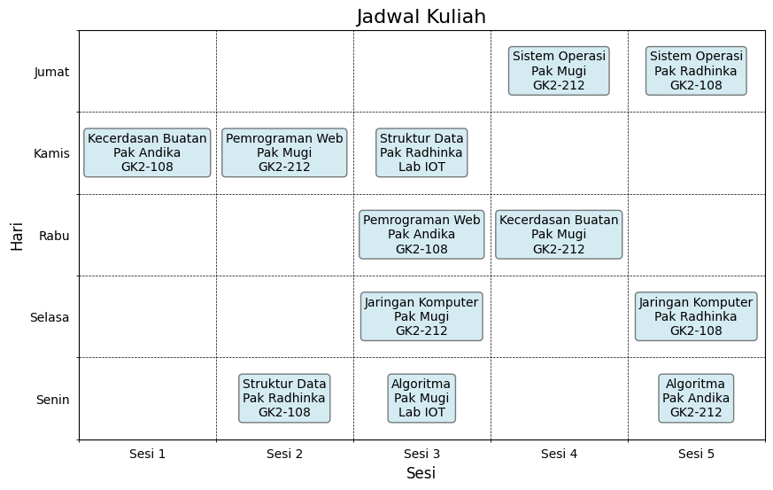

# Jadwal Kuliah dengan Algoritma Hill Climbing

Proyek ini adalah implementasi algoritma **Hill Climbing** untuk menyusun jadwal kuliah berdasarkan sejumlah parameter dan kendala tertentu, seperti jumlah mata kuliah, dosen tetap, ruang kelas, dan waktu.

## 🚀 Fitur
- Menyusun jadwal kuliah secara optimal menggunakan algoritma **Hill Climbing**.
- Menghindari konflik penggunaan ruangan dan dosen.
- Visualisasi jadwal kuliah menggunakan **Matplotlib**.
- Parameter yang dapat disesuaikan:
  - **Mata Kuliah**: Algoritma, Sistem Operasi, Struktur Data, Jaringan Komputer, Kecerdasan Buatan, Pemrograman Web.
  - **Dosen**: Pak Andika, Pak Radhinka, Pak Mugi.
  - **Ruangan**: Lab IOT, GK2-212, GK2-108.
  - **Hari**: Senin hingga Jumat.

## 📚 Struktur Proyek
- **`HillClimbSearch.ipynb`**: Implementasi algoritma Hill Climbing dan fungsi visualisasi jadwal.

## 📋 Parameter Masukan
1. **Mata Kuliah**: 6 mata kuliah utama dengan 2 sesi per minggu.
2. **Dosen Tetap**: 3 dosen tetap untuk mengajar.
3. **Ruangan**: 3 ruangan tersedia.
4. **Hari dan Waktu**: Jadwal dibuat untuk 5 hari (Senin-Jumat) dengan maksimal 5 sesi per hari.

## 📊 Algoritma
1. **Inisialisasi Jadwal Awal**: Membuat jadwal awal secara acak dengan memastikan tidak ada slot kosong untuk kebutuhan mata kuliah.
2. **Evaluasi Biaya**: Menghitung jumlah konflik (dosen atau ruangan yang sama di waktu bersamaan).
3. **Neighbor Generation**: Membuat tetangga baru dengan menukar dua slot secara acak.
4. **Hill Climbing**: Memilih tetangga dengan biaya yang lebih rendah dan iterasi hingga tidak ada peningkatan lebih lanjut.

## 🔧 Instalasi dan Penggunaan
1. Clone repositori ini:
   ```bash
   git clone https://github.com/pataanggs/Inteligensi-Buatan.git
   ```
2. Masuk ke direktori proyek:
   ```bash
    cd Inteligensi-Buatan
   ```
3. Install dependensi:
   ```bash
   pip install -r requirements.txt
   ```
4. Jalankan kode Python:
   ```bash
   python hill_climbing_schedule.py
   ```

## 🖼️ Contoh Visualisasi Jadwal


Setiap sel menampilkan **mata kuliah**, **dosen**, dan **ruangan** untuk sesi tertentu. Konflik akan ditampilkan sebagai biaya yang dapat dioptimalkan lebih lanjut.

## 🛠️ Teknologi yang Digunakan
- **Python**: Bahasa pemrograman utama.
- **Matplotlib**: Untuk visualisasi jadwal.
- **NumPy**: Untuk manipulasi data.

---

⭐ **Jangan lupa beri bintang jika Anda merasa proyek ini bermanfaat!**